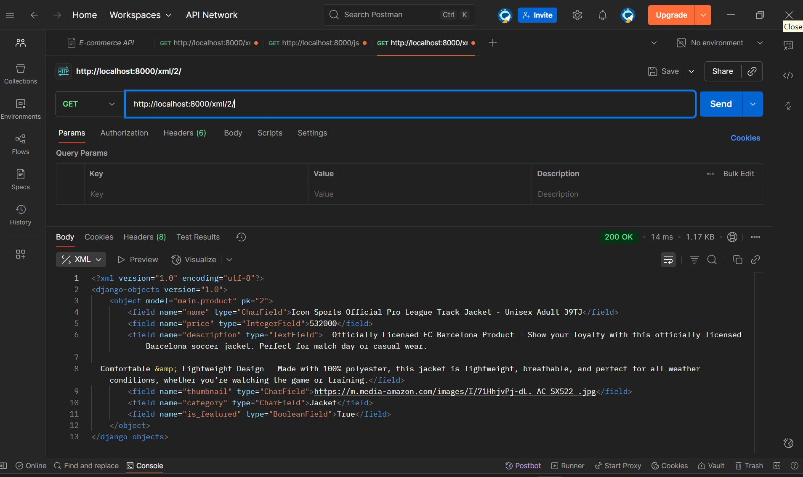
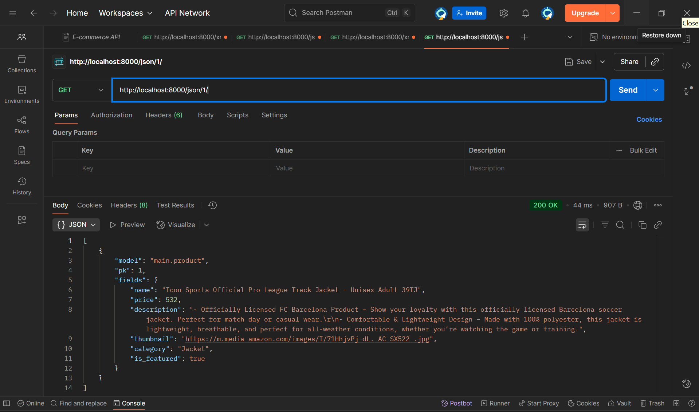

Tautan menuju aplikasi PWS yang sudah di-deploy : https://elizabeth-meilanny-eleleven.pbp.cs.ui.ac.id

1.Jelaskan mengapa kita memerlukan data delivery dalam pengimplementasian sebuah platform?
Data delivery sangat diperlukan dalam mengimplementasikan sebuah platform karena dapat memastikan ketepatan dan keakuratan waktu dikirimnya data user. Artinya, data delivery memiliki tujuan, yaitu untuk meningkatkan efisiensi dan kepuasan user dalam proses pengiriman.

2.Menurutmu, mana yang lebih baik antara XML dan JSON? Mengapa JSON lebih populer dibandingkan XML?
JSON lebih populer dibandingkan XML karena JSON dinilai lebih baik untuk banyak aplikasi saat ini. Keunggulannya karena sintaksnya lebih ringkas, lebih sederhana, mudah dibaca manusia, dan JSON mendukung struktur data Javascript dan python yang sangat cocok untuk aplikasi web terkini dan pengembangan API. Selain itu, dengan lancarnya integrasi dengan Javascript, proses pertukaran data pun dapat lebih efisien

3.Jelaskan fungsi dari method is_valid() pada form Django dan mengapa kita membutuhkan method tersebut?
Method is_valid() di Django berfungsi untuk memvalidasi data-data yang user masukan ke dalam formulir. Karena method ini berfungsi untuk memvalidasi data, maka method tersebut dibutuhkan untuk memastikan data yang diterima sudah sesuai atau belum. Jika tidak ada method is_valid, maka bisa saja format yang ada pada data dinilai salah atau tidak sesuai.

4.Mengapa kita membutuhkan csrf_token saat membuat form di Django? Apa yang dapat terjadi jika kita tidak menambahkan csrf_token pada form Django? Bagaimana hal tersebut dapat dimanfaatkan oleh penyerang?
Saat membuat form di Django, csrf_token dibutuhkan untuk mencegah CSRF terjadi. Hal ini dicegah karena jika terjadi, maka penyerang dapat melakukan permintaan yang tidak sesuai dengan mengatasnamakan user yang sudah login sehingga memungkinkan ancaman terhadap keamanan data terjadi.

5.Jelaskan bagaimana cara kamu mengimplementasikan checklist di atas secara step-by-step (bukan hanya sekadar mengikuti tutorial).
- Pertama, saya membuka folder footballshop saya, yaitu El Eleven untuk memastikan kesesuaiannya. Lalu saya memBuat direktori templates pada direktori utama (root folder) dan menambahkan berkas base.html di dalamnya sebagai template dasar. 
- Lalu, saya menambahkan konten pada settings.py dan mengubah berkas main.html agar sesuai dg ketentuan soal.
Setelah itu, saya membuat berkas baru forms.py pd direktori main dan menambahkan fields yang akan digunakan untuk form dan mengubah berkas forms.py & urls.py utk menambahkan beberapa import
- Setelah itu,, saya menambahkan html berkas baru pada folder templates dalam main untuk add product dan product detail dan menambahkan entri url proyek pws pada CSRF_TRUSTED_ORIGINS di dalam settings.py
- Lalu jalankan perintah python manage.py runserver dan cek http://localhost:8000/ di browser 
- Jika sudah sesuai, maka lakukan pengembalian data dalam bentuk XML dan JSON. Lakukan juga untuk pengembalian data berdasarkan ID dalam bentuk XML dan JSON
- Lalu jalankan proyek Django dengan perintah python manage.py runserver dan cek http://localhost:8000/xml/[news_id]/ atau http://localhost:8000/json/[news_id]/ 
- Setelah itu, pastikan pengiriman data sesuai atau tidak dengan membuka postman dan membuat sebuah request baru dengan method GET dan url http://localhost:8000/xml/ atau http://localhost:8000/json/ 

6.Apakah ada feedback untuk asdos di tutorial 2 yang sudah kalian kerjakan?
Menurut saya, tutorial 2 sudah cukup membantu dan memberikan penjelasan terkait materi secara informatif dan deskriptif, seperti tutorial sebelumnya. Feedback dari saya, semoga keinformatifan yang ada di tutorial 2 dapat selalu dipertahankan agar mahasiswa/i dapat mengerti secara teori dan praktik, seperti halnya yang terdapat pada tutorial 2.

Screenshot dari hasil akses URL pada Postman :
XML :

XML ID :

JSON :
 
 

JSON ID :

