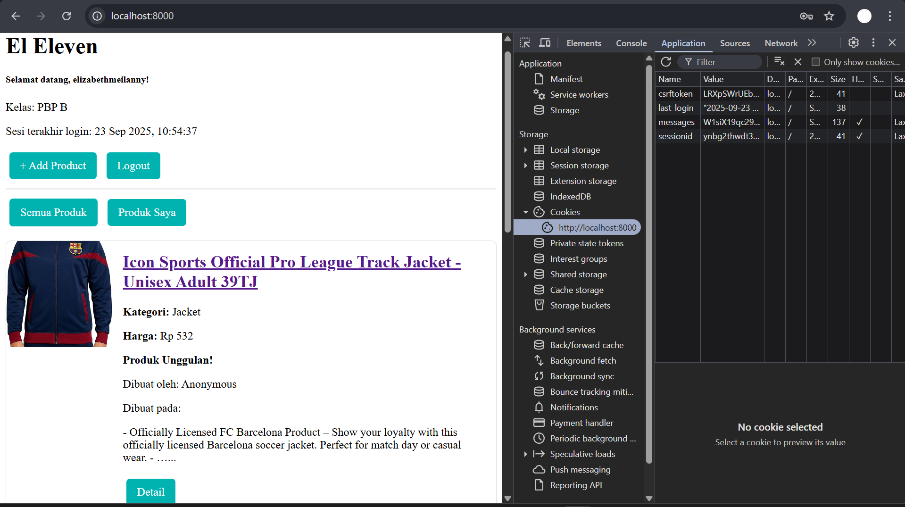

1. Apa itu Django AuthenticationForm? Jelaskan juga kelebihan dan kekurangannya.
> Django AuthenticationForm adalah form bawaan yang digunakan untuk verifikasi siapa diri kita atau login dengan username dan password

> Kelebihan Django AuthenticationForm adalah mudah diimplementasikan karena user hanya perlu mengimport dan menggunakannya di view. Selain itu, Django AuthenticationForm menyediakan validasi data secara otomatis untuk kesesuaian username dan password user dan menyediakan dukungan built-in error message ketika terdapat kesalahan atau error.

> Kekurangan Django AuthenticationForm adalah tidak adanya fitur registrasi untuk pengguna baru yang belum memiliki akun dan tidak adanya fitur forgot password untuk user yang ingin mereset passwordnya sehingga Django AuthenticationForm juga kurang fleksibel untuk user yang ingin login secara khusus by email atau lainnya.

2. Apa perbedaan antara autentikasi dan otorisasi? Bagaiamana Django mengimplementasikan kedua konsep tersebut?
> Autentikasi => Verifikasi identitas user (login username dan password)
> Otorisasii => Penentuan hak akses user (akses user atau akses admin)
Django mengimplementasikan autentikasi dengan menggunakan sistem autentikasi bawaan, seperti model user, fungsi autentikasi, login dan logout, dan AuthenticationForm. Lalu django mengimplementasikan otorisasi dengan menggunakan permission, decorator, dan groups yang lebih fleksibel.

3. Apa saja kelebihan dan kekurangan session dan cookies dalam konteks menyimpan state di aplikasi web?
> Session : Memiliki kelebihan di bidang security atau keamanan karena data disimpan di dalam server. Akan tetapi, memiliki kekurangan terkait kebutuhan penyimpanan server (memori, disk, dan database) untuk menyimpan aktivitas user.
> Cookies : Memiliki kelebihan akses data yang lebih efisien untuk client dan server. Akan tetapi, memiliki kekurangan, yaitu rentan terhadap data sensitive karena display by url.

4. Apakah penggunaan cookies aman secara default dalam pengembangan web, atau apakah ada risiko potensial yang harus diwaspadai? Bagaimana Django menangani hal tersebut?
By default, penggunaan cookies tidak aman karena rentan terhadap attacks. Risiko potensial yang harus diwaspadai, seperti Cross-Site Request Forgery (CSRF) dan Cross-Site Scripting(XSS). Akan tetapi, django dapat menangani hal tersebut dengan CSRF Protection yang kuat by default dengan cara mengirimkan csrf token di cookie. Ketika permintaan POST diterima user, maka Django akan mengcompare kedua token tersebut apakah sama atau tidak. Jika sama, maka verifikasi berhasil dan akun user menjadi aman terhadap serangan dari luar user.

5. Jelaskan bagaimana cara kamu mengimplementasikan checklist di atas secara step-by-step (bukan hanya sekadar mengikuti tutorial).
> Pertama, saya membuat fungsi dan form registrasi, seperti yang ada di tutorial 3 lalu merestriksi akses halaman main dan product detail
> Lalu, saya melogout aplikasi django dan menambahkan import HttpResponseRedirect, reverse, dan datetime, pada bagian paling atas, mengubah kode, logout, dan kode lainnya untuk menggunakan data dari cookies
> Selanjutnya, saya menghubungkan model product dengan user dengan menabahkan model product tersebut pada models.py dan mengubah kode fungsi create product, dan lain- lain
> Terkait Membuat dua akun pengguna dengan masing-masing tiga dummy data menggunakan model yang telah dibuat sebelumnya, saya lakukan di lokal
